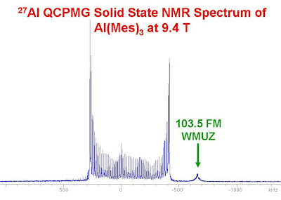
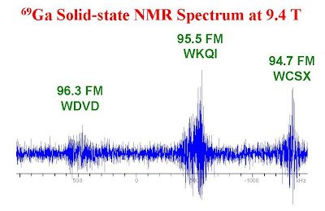

# BRUCKER NMR FID FM DEMODULATOR
Резонансные частоты некоторых ядер попадают в FM диапазон 87-108MHz и иногда при недостаточной экранировке сигнал станции может пролезть в fid. Это явление известное и неоднократно описанное, например [здесь](https://u-of-o-nmr-facility.blogspot.com/2008/05/interference-from-fm-radio-stations.html)

В нашем случае на спектрометре "Q. One AS600" дейтериевый канал имеет частоту 96MHz что попадает аккурат в радиостанцию "Москва FM". В качестве эксперимента был записан спектр на датчике со снятым кожухом. Зарегистрированный фид можно демодулировать и услышать саму радиостанцию, для этого написаны два скрипта brucker_fid_fm_demodulator_v0.9.py и brucker_fid_quad_fm_demodulator_v0.9.py отличаются они только алгоритмом демодуляции. Образцы фидов сконвертированные в формат Brucker лежат в директориях 5, 6 и 11.

The resonant frequencies of some nucleus fall into the FM range 87-108MHz, and sometimes, with insufficient shielding, the station's signal can slip into the fid. This phenomenon is well-known and has been repeatedly described, for example [here](https://u-of-o-nmr-facility.blogspot.com/2008/05/interference-from-fm-radio-stations.html )

In our case, on the "Q One AS600" spectrometer.  deuterium channel has a frequency of 96 MHz, which falls exactly into the "Moskva FM" radio station. As an experiment, the spectrum was recorded on a sensor with the casing removed. The registered fid, you can demodulate and hear the radio station itself. Two scripts have been written for this. brucker_fid_fm_demodulator_v0.9.py and brucker_fid_quad_fm_demodulator_v0.9.py they differ only in the demodulation algorithm. The sample feeds converted to the Brucker format are located in directories 5, 6 and 11.

## dependencies
nmrglue, numpy, scipy

## Using
$./run.sh

or

$./brucker_fid_quad_fm_demodulator_v0.9.py path_to_fid

$./brucker_fid_fm_demodulator_v0.9.py path_to_fid
